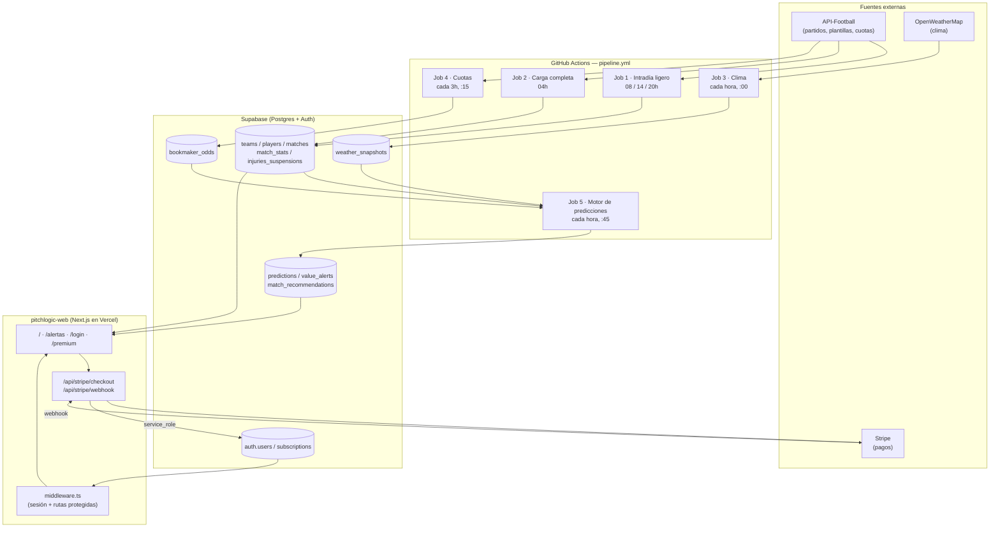
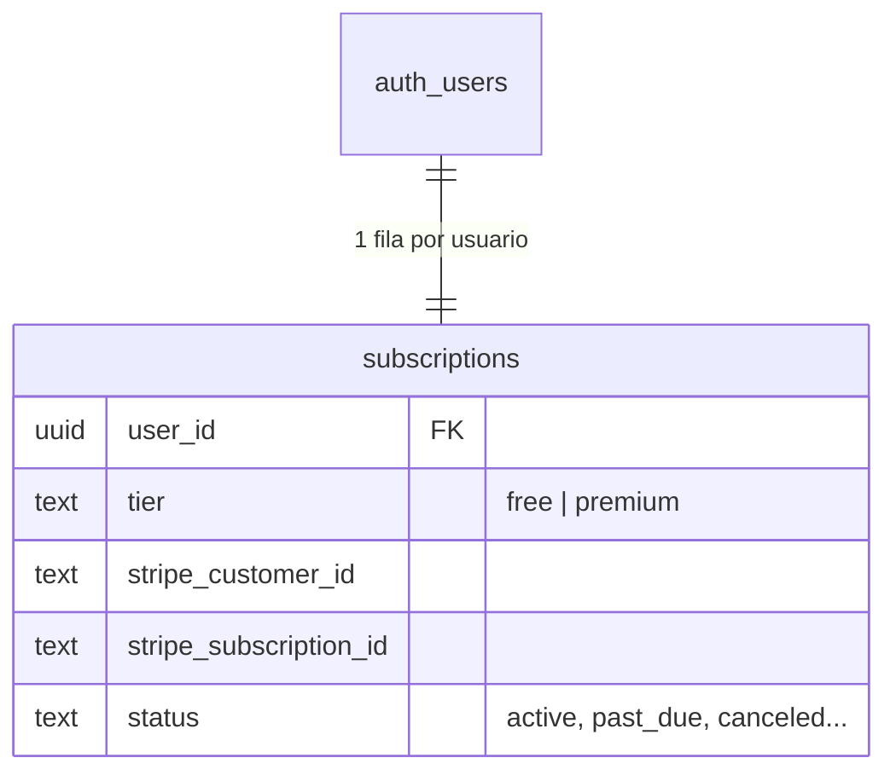

# PitchLogic Analytics

Motor de analítica avanzada de fútbol (tipo AdamChoi, extendido) que combina
un modelo de deducción propio en **4 capas ponderadas** con datos en vivo de
partidos, plantillas, clima y árbitros, para generar predicciones y alertas
de valor en los mercados de **1X2 / Doble Oportunidad, remates, córners,
tarjetas y faltas** — servidas en una app web/PWA con acceso **freemium**
(recomendaciones públicas, alertas de mayor valor tras suscripción vía
Stripe).

Actualmente scopeado a **LaLiga, temporada 2026/2027**, con arquitectura
preparada para añadir más ligas sin cambios estructurales.

---

## 1. Arquitectura del sistema



**Componentes:**

| Capa | Tecnología | Responsabilidad |
|---|---|---|
| Ingesta | Python 3.11 (`requests`, `supabase-py`) | Partidos, plantillas, clima, cuotas |
| Motor de modelo | Python (`calculate_predictions.py`) | Las 4 capas → `predictions` / `value_alerts` / `match_recommendations` |
| Base de datos | Supabase (Postgres + RLS + Auth) | Persistencia, seguridad de acceso, sesiones, nivel de suscripción |
| Orquestación backend | GitHub Actions (`pipeline.yml`) | 5 jobs programados por cron + ejecución manual |
| Frontend | Next.js 15 (App Router) + Tailwind, en Vercel | Dashboard, feed de alertas, auth, checkout — PWA instalable |
| Pagos | Stripe Checkout + Webhooks | Conversión free → premium |

El modelo corre en modo **job batch precalculado**: nunca se ejecuta en
tiempo real ante una petición del usuario — todo se calcula de antemano y el
frontend solo lee filas ya resueltas en Supabase, lo que lo hace rápido y
barato de servir.

---

## 2. El modelo de 4 capas

Cada predicción (`predictions`) guarda, por separado, la probabilidad que
arroja cada capa, más la probabilidad final combinada — total trazabilidad,
capa por capa, para poder auditar el modelo contra tu Google Sheet validado.

```
composite_probability = 0.40·Capa1 + 0.25·Capa2 + 0.20·Capa3 + 0.15·Capa4
```

| Capa | Peso | Qué mide | Cómo se calcula |
|---|---|---|---|
| **1. Rendimiento base / xG** | 40% | Fuerza histórica de ataque/defensa | Modelo de Poisson (ataque × defensa rival), separado en casa/fuera, con **shrinkage bayesiano** hacia el promedio de la liga cuando hay pocos partidos jugados. La ventaja de local sale de los propios datos, no de un multiplicador fijo. |
| **2. Plantilla y bajas** | 25% | Impacto real de lesiones/sanciones | Reduce el λ ofensivo del equipo según la suma ponderada de `player_importance_score` de los jugadores confirmados fuera (peso 100%) o dudosos (peso 50%), con un tope máximo de reducción del 25%. |
| **3. Descanso y fatiga** | 20% | Congestión de calendario | Penaliza partidos con ≤3 días de descanso o ≥3 partidos en los últimos 14 días; bonifica ligeramente ≥7 días de descanso. |
| **4. Factores contextuales** | 15% | Clima y árbitro | Lluvia fuerte / viento alto reduce remates y córners esperados, aumenta faltas. El histórico del árbitro (`referee_stats`) escala específicamente los mercados de tarjetas y faltas. |

Cada capa **recalcula su propia probabilidad de Poisson** con el λ (lambda)
ajustado — no son "puntuaciones" arbitrarias 0-100, sino probabilidades
reales bajo cada escenario, que luego se combinan linealmente con los pesos
de tu modelo validado.

### Mercados cubiertos

| Mercado | Código (`markets.code`) | Nivel |
|---|---|---|
| Resultado 1X2 | `1X2` | Partido |
| Doble Oportunidad (1X, X2, 12) | `DOUBLE_CHANCE` | Partido |
| Goles totales Over/Under | `MATCH_GOALS_OU` | Partido |
| Remates del equipo O/U | `TEAM_SHOTS_OU` | Equipo |
| Córners del equipo O/U | `TEAM_CORNERS_OU` | Equipo |
| Faltas del equipo O/U | `TEAM_FOULS_OU` | Equipo |
| Tarjetas del equipo O/U | `TEAM_CARDS_OU` | Equipo |
| Córners totales del partido O/U | `MATCH_CORNERS_OU` | Partido |
| Tarjetas totales del partido O/U | `MATCH_CARDS_OU` | Partido |
| Faltas totales del partido O/U | `MATCH_FOULS_OU` | Partido |

*(El catálogo de `markets` es abierto — añadir un mercado nuevo es un
`INSERT`, no requiere migración.)*

### Recomendación de quiniela (`match_recommendations`) — acceso público

Una fila resumen por partido que combina 1X2 + Doble Oportunidad en una
única "casilla" recomendada:

- **Victoria simple** (`1` / `X` / `2`) si su probabilidad ≥ **60%**
- **Doble Oportunidad** (`1X` / `X2` / `12`) si su probabilidad ≥ **52%** (sin techo superior — un 1X al 75% sigue siendo un pick válido)
- **Sin recomendación** si ninguna alcanza el umbral (partido genuinamente parejo)

### Alertas de valor (`value_alerts`) — gating freemium

Comparan `composite_probability` del modelo contra la probabilidad implícita
de la mejor cuota disponible en `bookmaker_odds`. Solo existen para mercados
con cuota comercial de referencia — **1X2, Doble Oportunidad y Goles
totales**. Remates/córners/tarjetas/faltas no tienen cuotas disponibles vía
API estándar, así que siguen teniendo `composite_probability` (100% modelo
propio) pero nunca generan alerta de valor, lo cual es el comportamiento
esperado.

| Edge del modelo vs. cuota | Nivel de alerta | Acceso en el frontend |
|---|---|---|
| ≥ 15% | `premium` | 🔒 Requiere suscripción Premium |
| 10% – 14.9% | `high` | 🔒 Requiere suscripción Premium |
| 5% – 9.9% | `medium` | 🔓 Público / gratuito |
| < 5% | *(no se genera alerta)* | — |

---

## 3. Frontend (Next.js App Router)

`pitchlogic-web/` es una app Next.js 15 (App Router) + Tailwind, desplegada
en Vercel, pensada para funcionar como PWA instalable en web y móvil.

### 3.1. Autenticación y sesiones — `@supabase/ssr`

Next.js App Router mezcla Server Components, Route Handlers y Middleware,
cada uno con su propio acceso a cookies — `@supabase/ssr` es el paquete que
Supabase mantiene específicamente para compartir la sesión entre los tres.

| Archivo | Runtime | Uso |
|---|---|---|
| `lib/supabase/client.ts` | Navegador | Client Components (`"use client"`) — clave anon |
| `lib/supabase/server.ts` | Servidor | Server Components, Route Handlers, Server Actions — clave anon + cookies de sesión |
| `lib/supabase/admin.ts` | Servidor, solo confianza | Webhook de Stripe, checkout — clave **service_role**, bypassa RLS. Protegido con el paquete `server-only` para que el build falle si un Client Component lo importa por error |
| `middleware.ts` | Edge | Refresca el token de sesión en cada request; redirige a `/login` las rutas que exigen sesión (`/account`) |

**Importante:** cualquier Server Component que llame a `lib/supabase/server.ts`
(porque necesita saber si hay sesión) queda marcado por Next.js como
**dinámico** — se renderiza en cada request, no se sirve desde caché
estática. Es el caso de `/` y `/alertas` (ambas muestran el `UserMenu`).

### 3.2. Gating freemium

- `components/auth/AuthProvider.tsx` — contexto de React (`useAuth()`) que expone `{ user, tier, isPremium, loading }`. Carga `tier` desde `subscriptions` en cuanto detecta sesión.
- `components/auth/PremiumGate.tsx` — envuelve cualquier contenido premium. Usuario `premium`: contenido normal. Usuario `free`/sin sesión: contenido difuminado + CTA (a `/login` o directo a `/api/stripe/checkout`).
- **Nadie puede autoasignarse `premium`**: la tabla `subscriptions` no tiene política de `INSERT`/`UPDATE` para el rol `authenticated` (ver migración 003) — solo `service_role` escribe ahí, desde el checkout (solo el `stripe_customer_id`) y desde el webhook (el cambio real de `tier`, solo tras pago confirmado).

### 3.3. Páginas y rutas

| Ruta | Qué es | Acceso |
|---|---|---|
| `/` | Dashboard de recomendaciones de quiniela (`match_recommendations`) | Público |
| `/alertas` | Feed de Alertas de Valor, dividido en sección gratuita (`medium`) y sección premium (`high`/`premium`, tras `<PremiumGate>`) | Público (parcial) |
| `/login` | Login / registro / enlace mágico (`AuthForm`, tres modos) | Público |
| `/premium` | Pantalla de suscripción con botón de checkout | Público (requiere sesión para completar el pago) |
| `/api/stripe/checkout` | Route Handler (POST) — crea la sesión de Stripe Checkout y redirige | Requiere sesión |
| `/api/stripe/webhook` | Route Handler (POST) — recibe eventos de Stripe, activa/revoca `premium` | Verificado por firma, no por sesión |

### 3.4. Sistema de diseño

Estética de marcador de estadio, no de panel SaaS genérico:

| Token | Valor | Uso |
|---|---|---|
| `pitch` | `#10241C` | Fondo base |
| `chalk` | `#F3F1E7` | Texto principal |
| `turf` | `#2F6B4F` | Bloques, bordes |
| `amber` | `#E4A335` | **Único acento** — reservado para el pick/edge más fuerte |
| `rust` | `#C1553B` | Uso mínimo (errores, alertas de baja prioridad) |
| Tipografía | Oswald (condensada, números/picks) + Inter (texto) | Efecto marcador para probabilidades y cuotas |

---

## 4. Estructura del repositorio

```
.
├── .env.example                              # variables del backend (Python)
├── requirements.txt                          # dependencias Python
├── pitchlogic_schema.sql                     # migración 001 — esquema inicial
├── migration_002_double_chance.sql           # migración 002 — Doble Oportunidad + recomendaciones
├── migration_003_auth_subscriptions.sql      # migración 003 — Supabase Auth + subscriptions
├── migration_004_stripe.sql                  # migración 004 — campos de Stripe en subscriptions
├── ingest_laliga.py                          # equipos, partidos, estadísticas, jugadores
├── ingest_weather.py                         # clima (OpenWeatherMap)
├── ingest_odds.py                            # cuotas de casas de apuestas
├── calculate_predictions.py                  # motor del modelo de 4 capas
├── .github/workflows/pipeline.yml            # orquestador backend (5 jobs programados)
└── pitchlogic-web/                           # frontend Next.js
    ├── .env.local.example                    # variables del frontend (Next.js / Vercel)
    ├── middleware.ts
    ├── app/
    │   ├── page.tsx                          # Dashboard de recomendaciones
    │   ├── alertas/page.tsx                  # Feed de Alertas de Valor
    │   ├── login/page.tsx
    │   ├── premium/page.tsx
    │   ├── auth/{actions.ts, callback/route.ts}
    │   └── api/stripe/{checkout, webhook}/route.ts
    ├── components/{auth, alerts}/*.tsx
    └── lib/{supabase, format.ts, types.ts, stripe.ts}
```

---

## 5. Guía de despliegue — backend

### 5.1. Crear el proyecto en Supabase

1. Crea un proyecto en [supabase.com](https://supabase.com).
2. Ve a **Project Settings → API** y copia:
   - `Project URL` → será tu `SUPABASE_URL` / `NEXT_PUBLIC_SUPABASE_URL`
   - `anon public` key → será tu `NEXT_PUBLIC_SUPABASE_ANON_KEY` (frontend)
   - `service_role` key (**no** la anon) → será tu `SUPABASE_SERVICE_ROLE_KEY` (backend y rutas de servidor de confianza)

### 5.2. Ejecutar las migraciones SQL

En **SQL Editor** de Supabase, **en este orden exacto**:

1. `pitchlogic_schema.sql` — todas las tablas del backend, tipos, índices, RLS y el catálogo inicial de `markets`.
2. `migration_002_double_chance.sql` — enum de Doble Oportunidad + tabla `match_recommendations`.
3. `migration_003_auth_subscriptions.sql` — tabla `subscriptions` (gating freemium) + trigger de alta automática en `auth.users`. Supabase Auth ya viene activo por defecto en cualquier proyecto, esta migración no lo activa, solo añade la tabla propia.
4. `migration_004_stripe.sql` — añade `stripe_customer_id`, `stripe_subscription_id` y `status` a `subscriptions`.

> Los scripts son idempotentes donde es razonable (`create table if not exists`,
> `add column if not exists`, `add value if not exists`), pero ejecútalos una
> sola vez y en orden — no están pensados para reordenarse.

### 5.3. Conseguir las claves de las APIs externas

| Servicio | Dónde conseguir la clave | Nota |
|---|---|---|
| API-Football | [api-football.com](https://www.api-football.com) | El endpoint `/odds` suele requerir un plan de pago — verifícalo si vas a usar `ingest_odds.py` |
| OpenWeatherMap | [openweathermap.org/api](https://openweathermap.org/api) | El plan gratuito cubre pronóstico hasta ~5 días vista |

### 5.4. Variables de entorno del backend (desarrollo local)

```bash
cp .env.example .env
pip install -r requirements.txt
```

```
API_FOOTBALL_KEY=...
OPENWEATHERMAP_API_KEY=...
SUPABASE_URL=https://tu-proyecto.supabase.co
SUPABASE_SERVICE_ROLE_KEY=...
```

### 5.5. Primera carga de datos (orden recomendado)

```bash
# 1. Equipos, partidos, estadísticas y jugadores de LaLiga
python ingest_laliga.py --season 2026

# 2. Clima de los próximos partidos
python ingest_weather.py --hours-ahead 72

# 3. Cuotas disponibles (requiere plan de pago de API-Football)
python ingest_odds.py --season 2026 --hours-ahead 72

# 4. Motor del modelo — genera predictions / value_alerts / match_recommendations
python calculate_predictions.py --season 2026 --hours-ahead 72
```

Revisa en Supabase (**Table Editor**) que `predictions` y
`match_recommendations` tengan filas antes de pasar a producción.

### 5.6. Configurar GitHub Actions (producción del backend)

En tu repositorio → **Settings → Secrets and variables → Actions**:

**Pestaña "Secrets"** (4 secretos):

| Nombre | Valor |
|---|---|
| `API_FOOTBALL_KEY` | tu clave de api-football.com |
| `SUPABASE_URL` | `https://tu-proyecto.supabase.co` |
| `SUPABASE_SERVICE_ROLE_KEY` | la service_role key de Supabase |
| `OPENWEATHERMAP_API_KEY` | tu clave de OpenWeatherMap |

**Pestaña "Variables"** (1 variable, no sensible):

| Nombre | Valor |
|---|---|
| `LALIGA_SEASON` | `2026` |

Haz commit de `.github/workflows/pipeline.yml` a la rama por defecto de tu
repo (GitHub solo detecta y programa workflows que viven en esa rama).

---

## 6. Los 5 jobs del orquestador backend

| # | Job | Cron (UTC) | Script | Qué hace |
|---|---|---|---|---|
| 1 | Intradía ligero | `0 8,14,20 * * *` | `ingest_laliga.py --skip-players` | Refresca partidos y resultados |
| 2 | Carga completa | `0 4 * * *` | `ingest_laliga.py` | Recalcula plantillas, bajas y `player_importance_score` |
| 3 | Clima | `0 * * * *` | `ingest_weather.py` | Pronóstico o clima actual según cercanía del partido |
| 4 | Cuotas | `15 */3 * * *` | `ingest_odds.py` | Cuotas de 1X2 / Doble Oportunidad / Goles O-U |
| 5 | Motor de predicciones | `45 * * * *` | `calculate_predictions.py` | Calcula las 4 capas y escribe resultados finales |

**Probar los jobs manualmente:** pestaña **Actions** del repo → workflow
"PitchLogic Analytics — Data Pipeline" → **Run workflow** → elige `intraday`,
`full`, `weather`, `odds`, `predictions` o `all`. Orden recomendado para la
primera prueba: `intraday` → `weather` → `odds` → `predictions`.

---

## 7. Guía de despliegue — frontend (Next.js + Vercel)

### 7.1. Instalación local

```bash
cd pitchlogic-web
npm install
npm install @supabase/ssr @supabase/supabase-js lucide-react stripe server-only

cp .env.local.example .env.local   # rellena con tus claves (ver sección 9)
npm run dev
```

### 7.2. Configurar Supabase Auth para el frontend

En Supabase → **Authentication → URL Configuration**, añade como *Redirect
URL*:

- `http://localhost:3000/auth/callback` (desarrollo)
- `https://tu-dominio.vercel.app/auth/callback` (producción, una vez desplegado)

Sin esto, el enlace mágico y la confirmación de registro por correo fallan
silenciosamente (Supabase rechaza la redirección).

### 7.3. Configurar Stripe

**a) Crear el producto y el precio**

1. [Stripe Dashboard](https://dashboard.stripe.com) → **Product catalog** → **Add product**.
2. Nombre: "PitchLogic Premium". Precio: recurrente, mensual (o el ciclo que prefieras).
3. Copia el **Price ID** (`price_...`, no el Product ID) → será tu `STRIPE_PRICE_ID`.

**b) Probar webhooks en desarrollo local con Stripe CLI**

Stripe no puede llamar a `localhost` directamente, así que la [Stripe
CLI](https://stripe.com/docs/stripe-cli) reenvía los eventos:

```bash
stripe login
stripe listen --forward-to localhost:3000/api/stripe/webhook
```

El comando imprime un secreto `whsec_...` — cópialo en `STRIPE_WEBHOOK_SECRET`
de tu `.env.local`. Es un secreto **distinto** al que usarás en producción;
`stripe listen` genera uno nuevo cada vez que lo corres, así que revisa que
tu `.env.local` tenga el actual antes de probar un pago de prueba.

Con `stripe listen` corriendo en una terminal y `npm run dev` en otra, puedes
completar un checkout con una [tarjeta de prueba de
Stripe](https://stripe.com/docs/testing) (ej. `4242 4242 4242 4242`, cualquier
fecha futura y CVC) y ver en los logs de ambas terminales cómo el webhook
activa `premium` en `subscriptions`.

**c) Configurar el webhook en producción (Vercel)**

Una vez tengas tu dominio de Vercel:

1. Stripe Dashboard → **Developers → Webhooks → Add endpoint**.
2. URL del endpoint: `https://tu-dominio.vercel.app/api/stripe/webhook`.
3. Eventos a escuchar (selecciona solo estos tres):
   - `checkout.session.completed`
   - `customer.subscription.updated`
   - `customer.subscription.deleted`
4. Copia el **Signing secret** de este endpoint (`whsec_...`, distinto al de
   `stripe listen`) → será tu `STRIPE_WEBHOOK_SECRET` **en Vercel**, no en local.

> Nota sobre el criterio de revocación: el webhook trata cualquier estado de
> suscripción que no sea `active`/`trialing` (incluido `past_due`, pago
> fallido con reintentos en curso) como motivo para revocar `premium` de
> inmediato. Es una decisión deliberada para este MVP — prioriza proteger el
> valor del contenido exclusivo sobre dar un periodo de gracia. Si más
> adelante quieres un margen antes de revocar, es un cambio de una línea en
> `app/api/stripe/webhook/route.ts` (`ACTIVE_SUBSCRIPTION_STATUSES`).

### 7.4. Desplegar en Vercel

1. Importa el repositorio en [vercel.com](https://vercel.com/new).
2. **Root Directory**: `pitchlogic-web` (el repo tiene el backend Python en la raíz y el frontend en un subdirectorio — Vercel necesita saber cuál construir).
3. Añade todas las variables de la sección 9 en **Settings → Environment Variables**.
4. Despliega. Una vez tengas la URL definitiva, vuelve a los pasos 7.2 y 7.3(c) para registrar esa URL real en Supabase y Stripe (ambos la necesitan para redirigir correctamente).

### 7.5. Iconos de PWA

`app/manifest.ts` referencia `/public/icons/icon-192.png` y `icon-512.png`,
que todavía no existen en el repo — añádelos para que los navegadores
ofrezcan "Instalar app" con un icono real en vez de uno genérico.

---

## 8. Modelo de datos de autenticación



- Al registrarse un usuario, un trigger (`handle_new_user`, migración 003)
  crea automáticamente su fila en `subscriptions` con `tier = 'free'`.
- El checkout (`/api/stripe/checkout`) solo escribe `stripe_customer_id`.
- El webhook (`/api/stripe/webhook`) es el único que escribe `tier`,
  `stripe_subscription_id` y `status` — y solo tras verificar la firma de
  Stripe con `STRIPE_WEBHOOK_SECRET`.

---

## 9. Variables de entorno — lista consolidada para producción

### Backend (GitHub Actions Secrets/Variables — ver sección 5.6)

| Variable | Dónde se usa |
|---|---|
| `API_FOOTBALL_KEY` | `ingest_laliga.py`, `ingest_odds.py` |
| `OPENWEATHERMAP_API_KEY` | `ingest_weather.py` |
| `SUPABASE_URL` | Los 4 scripts Python |
| `SUPABASE_SERVICE_ROLE_KEY` | Los 4 scripts Python |
| `LALIGA_SEASON` *(Variable, no Secret)* | Fallback de temporada en `pipeline.yml` |

### Frontend (Vercel → Settings → Environment Variables)

| Variable | Pública/privada | Dónde se usa |
|---|---|---|
| `NEXT_PUBLIC_SUPABASE_URL` | Pública | `lib/supabase/client.ts` y `server.ts` |
| `NEXT_PUBLIC_SUPABASE_ANON_KEY` | Pública (RLS la protege) | `lib/supabase/client.ts` y `server.ts` |
| `SUPABASE_SERVICE_ROLE_KEY` | **Privada** | `lib/supabase/admin.ts` (checkout, webhook) — nunca con prefijo `NEXT_PUBLIC_` |
| `NEXT_PUBLIC_SITE_URL` | Pública | Redirects de Supabase Auth y de Stripe Checkout |
| `STRIPE_SECRET_KEY` | **Privada** | `lib/stripe.ts` |
| `STRIPE_WEBHOOK_SECRET` | **Privada** | `app/api/stripe/webhook/route.ts` — distinto en local (`stripe listen`) vs. producción (Dashboard) |
| `STRIPE_PRICE_ID` | Pública (no es sensible, pero no necesita prefijo) | `app/api/stripe/checkout/route.ts` |

> Regla general de Next.js: cualquier variable con prefijo `NEXT_PUBLIC_`
> termina en el bundle del navegador — úsalo solo para lo que sea seguro
> exponer (URLs, claves ya protegidas por RLS). Todo lo demás (claves
> `service_role`, `secret`, `webhook`) se queda sin ese prefijo y solo vive
> en el servidor.

---

## 10. Próximos pasos

Con esto, PitchLogic Analytics queda cerrado de punta a punta: ingesta →
modelo de 4 capas → alertas de valor → recomendaciones de quiniela →
frontend con auth freemium → checkout y webhook de Stripe. Ideas para
después del MVP, sin bloquear el lanzamiento:

- Mover la deduplicación de `match_recommendations` / `value_alerts` (hoy
  resuelta en el cliente, en `lib/format.ts`) a una vista SQL
  (`create view ... distinct on (...)`) si el volumen de filas históricas
  crece lo suficiente como para notarlo.
- Añadir los iconos reales de PWA (`/public/icons/icon-192.png`, `icon-512.png`).
- Periodo de gracia en `past_due` antes de revocar `premium` (ver nota en 7.3c).
- Más ligas además de LaLiga — la arquitectura ya está preparada, es cuestión de parametrizar `--league` en los jobs y en el frontend.
